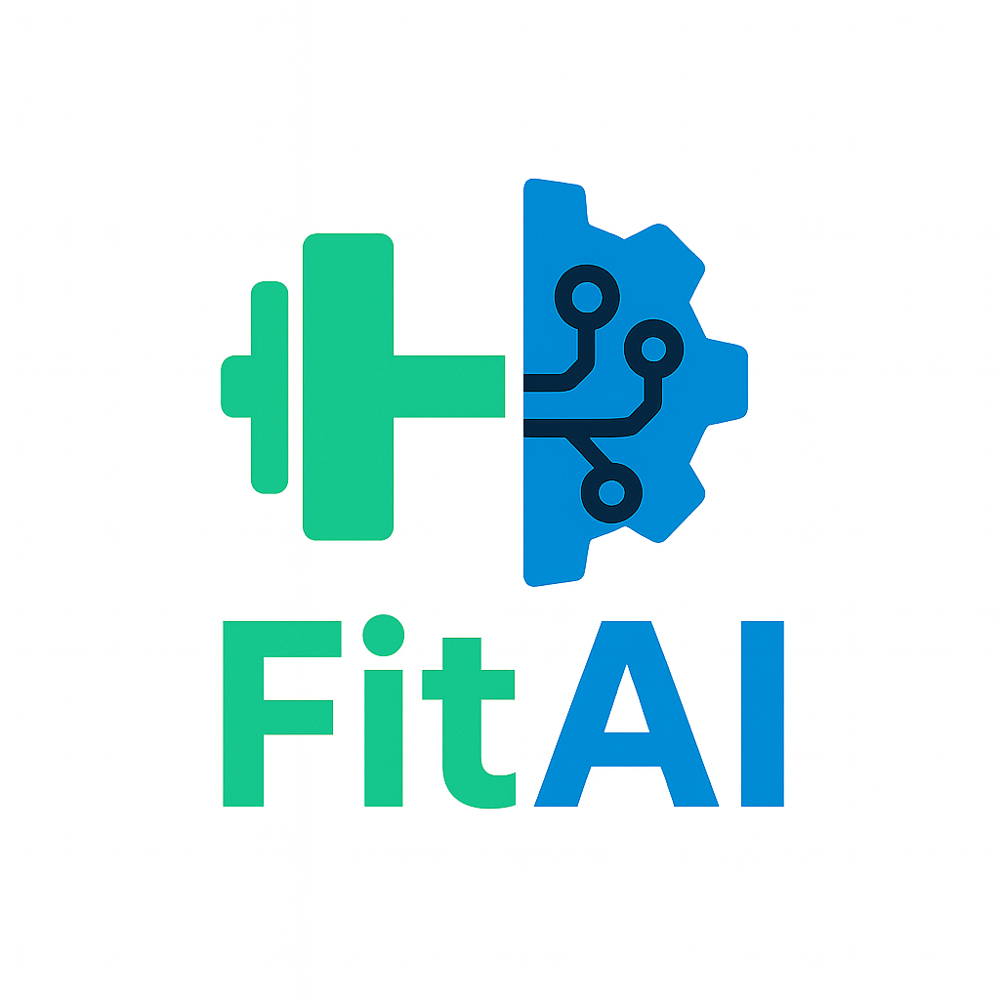

# FitAI

  

Personalized fitness coaching that blends user profiles with research-backed context via a RAG pipeline. Live on GKE at http://34.31.81.159/login.

Quick links: 
- Architecture Diagrams ([docs/solution-architecture.jpeg](docs/solution-architecture.jpeg), [docs/technical-architecture.jpeg](docs/technical-architecture.jpeg))
- Per-service READMEs under [services/](services/)
- Infra Stack at [infra/README.md](infra/README.md) with horizontal autoscaling demos
- UI Previews in [docs/UI_Screens.md](docs/UI_Screens.md)
- Data Versioning described in [docs/data-versioning.md](docs/data-versioning.md) with DVC remote `gs://fitai-data-bucket`.
- Automated Machine Learning Workflows at [docs/model-training.md](docs/model-training.md)

## Prerequisites and setup instructions
- **Local:** Docker + Docker Compose; ports: frontend 3000, core-etl-api 8001, rag-service 8002, ocr-engine 8003, calendar-agent 8004, Chroma 8000, Postgres 5432. Frontend dev needs Node 18+ (see [services/frontend/README.md](services/frontend/README.md)).
- **GCP/GKE (Pulumi):** Node 20+, Pulumi CLI, `gcloud auth login` + `gcloud auth application-default login`, access to Artifact Registry images; details in [infra/README.md](infra/README.md).
- **Secrets:** DB credentials, JWT keys, and GCP service accounts for local and GKE.
- **Data:** `dvc pull` from `fitai_data_bucket.dvc` (document exact workflow + access needs).

## Deployment instructions
- **Local:** `docker compose up --build -d`; check with `docker compose ps`; stop via `docker compose down -v`. Service-specific dev flows live in their READMEs (e.g., [services/rag-service/README.md](services/rag-service/README.md)).
- **CD (GitHub Actions):** Push to `main` (or trigger “CD”), whcih automatically builds all images, pushes to Artifact Registry, updates Pulumi config, and runs `pulumi up` for stack `zih428-org/FitAI_infra/dev`. Required GitHub secrets: `PULUMI_ACCESS_TOKEN`, `GCP_CREDENTIALS_JSON`; plus Pulumi config secrets (`dbPassword`, `jwtSecret`, `gcpServiceAccountKey`, etc.).
- **Manual GKE (Pulumi):** Set `PULUMI_HOME`, `pulumi stack select zih428-org/FitAI_infra/dev`, ensure images exist in Artifact Registry, then `pulumi up` after `gcloud` auth. Current load balancer: http://34.31.81.159/login. HPA demo and kubectl commands are in [infra/README.md](infra/README.md).

## Usage details and examples

See [docs/UI_Screens.md](docs/UI_Screens.md) for a quick walkthrough of the [Login → Profile Setup → AI Coach Chat → Personalized Fitness Plan Generation] flow.

- **Access the app:** Open the frontend URL for your environment (localhost:3000 when using Docker Compose; GKE load balancer IP above).
- **Log in or register:** Email, password, and name at `/login`; session tokens are cached for API calls.
- **Set up your profile:** Provide name, height, weight, gender, body type, age, and training goal; values persist to Postgres and feed chat + planning.
- **Chat with the AI Coach:** Ask questions or refine plans; chat is grounded on your profile and most recent plan so you don’t repeat details.
- **Generate a plan (two modes):**
  - Calendar-aware: On Training Plan, optionally upload a calendar image (PNG/JPG); `calendar-agent` parses availability and blends it with your goals to create a week.
  - Goal-only: Skip the upload to get a quick weekly plan driven by profile + goals; adjust via chat if needed.
- **Save and review weeks:** Save generated weeks to Postgres, switch between saved plans, regenerate from history, and download/preview ICS files on Weekly Plan.

## Known issues and limitations
- **Local:** AI Coach currently targets `http://localhost:8002` for rag-service in [services/frontend/app/ai-coach/page.tsx](services/frontend/app/ai-coach/page.tsx); non-local hosts need code or env updates.
- **GCP/GKE:** CORS allowed origins are currently hard coded to specific hostnames/IPs; if the load balancer IP changes after a full `pulumi destroy` and `pulumi up`, those origins will no longer match until updated.
