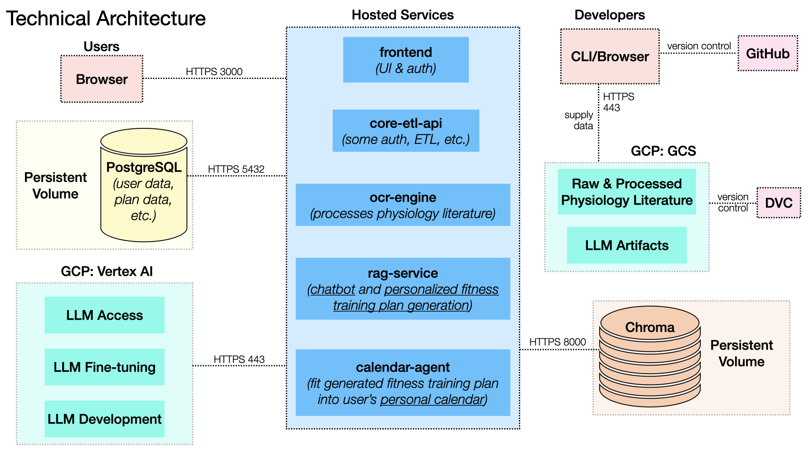

# AC215-Project-FitAI

**FitAI** is a containerized, end-to-end system that delivers personalized fitness recommendations powered by large language models (LLMs) and retrieval-augmented generation (RAG).

The platform integrates user-specific data such as body metrics and training goals with insights extracted from scientific literature on exercise physiology. These research papers are processed through an ETL and RAG pipeline that performs document chunking and vector embedding before storing them in a vector database (ChromaDB). When users interact with the system - whether asking training questions or requesting plan adjustments - the RAG module retrieves the most relevant literature chunks and combines them with the LLM’s reasoning to generate evidence-based, personalized recommendations.

By combining structured user data with knowledge from scientific sources, FitAI aims to create an adaptive and transparent foundation for intelligent fitness planning.

---

## 👩‍💻 Team Members
- Leo Cheng
- Faye Fang  
- Steven Ge  
- Harry Hu

---

## Milestone 4 Organization
```
├── README.md
├── data/                     # do not commit data; keep .gitkeep or tiny samples only
├── docs/                     # design/training/versioning docs
├── notebooks/                # analysis and exploration (e.g., GCS_Explorer.ipynb)
├── reference/                # reference docx/pdfs for MS4
├── reports/                  # presentations and summaries (e.g., midterm presentation)
├── services/                 # app services (frontend, APIs, workers, db)
├── sft/                      # fine-tuning configs, datasets (.dvc), scripts
├── docker-compose.yml        # local orchestration
└── screenshots/              # UI and bucket visuals
```

---

## Solution Architecture
```
[User]
  |
[Next.js Frontend]
  |-- chat/query --> [RAG Service] --> [ChromaDB] --> context --> [Vertex AI tuned Gemini]
  |-- auth/profile --> [Core ETL API] --> [Postgres]
  |-- calendar upload --> [Calendar Agent] --> plans --> [Postgres]
  |                                   |
  |                                   +--> optional calendar outputs to GCS
  |
  +--> (literature status) ---------> [OCR Engine] -> processed text -> [GCS bucket]

[GCS bucket] holds raw/processed literature + SFT datasets (DVC-tracked) feeding OCR/RAG/SFT.
```
- [ ] TODO: replace with actual diagram

## Technical Architecture
Here is our Technical Architecture:



Notes:
- GCS stores raw/processed literature and SFT datasets; snapshots tracked via DVC.
- Chroma collections are per chunking method (char/recursive/semantic) with cosine HNSW.
- Postgres holds users and generated plans; calendar-agent and frontend reuse the same profiles.
- Ports: frontend 3000, core-etl-api 8001, rag-service 8002, ocr-engine 8003, calendar-agent 8004, Chroma 8000, Postgres 5432.


---

## Container Structure
- `services/frontend/` → Next.js 14 UI (AI Coach, profile, training-plan flows)
- `services/rag-service/` → FastAPI RAG API (chunk, embed, query, chat) + Chroma client
- `services/ocr-engine/` → FastAPI OCR pipeline streaming PDFs from GCS to processed text
- `services/calendar-agent/` → FastAPI planner with GPT-4o Vision + plan persistence
- `services/core-etl-api/` → FastAPI user/auth service with Postgres + ETL hooks
- `services/db/` → Postgres database (schema in `services/db/init.sql`)
- `services/chromadb/` → Chroma vector DB (persistent volume under `docker-volumes/chromadb`)
- `docker-compose.yml` → brings up the full stack locally

---

## Backend APIs
- RAG Service (port 8002): `/health`, `/process-gcs` (GCS → chunks → embeddings → Chroma), `/query` (vector search), `/chat` (RAG answer with optional profile), `/collections` (list).
- Core ETL API (port 8001): `/auth/login`, `/auth/register`, `/users/me`, `/users/{id}`, `/training-plans` (retrieve saved plans); JWT-based auth with Postgres persistence.
- Calendar Agent (port 8004): `/health`, `/process_calendar` (OCR calendar image), `/planner` (generate plan with optional calendar upload), `/planner/save`, `/planner/history`.
- OCR Engine (port 8003): `/health`, `/perform-ocr` (incremental or full reprocess of GCS PDFs to text).

---

## Data Versioning (DVC)

We use DVC to version-control all literature data stored in our GCS bucket (gs://fitai-data-bucket).

Setup
```bash
dvc import-url gs://fitai-data-bucket fitai_data_bucket
git add fitai_data_bucket.dvc
git commit -m "Track GCS literature dataset with DVC"
```

Update dataset version
```bash
dvc update fitai_data_bucket.dvc
git add fitai_data_bucket.dvc
git commit -m "Update literature dataset version"
```

Reproduce a dataset version
```bash
git checkout <commit>
dvc update fitai_data_bucket.dvc
```

All actual data remains in GCS; only DVC pointers are stored in Git. 

---

## 🚀 Quick Start

#### Run all containers
```bash
docker compose up --build -d
```

#### Shut down and remove containers (when finished)
```bash
docker compose down -v
```
