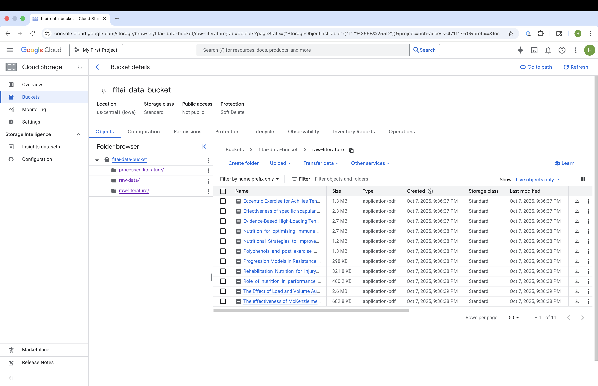
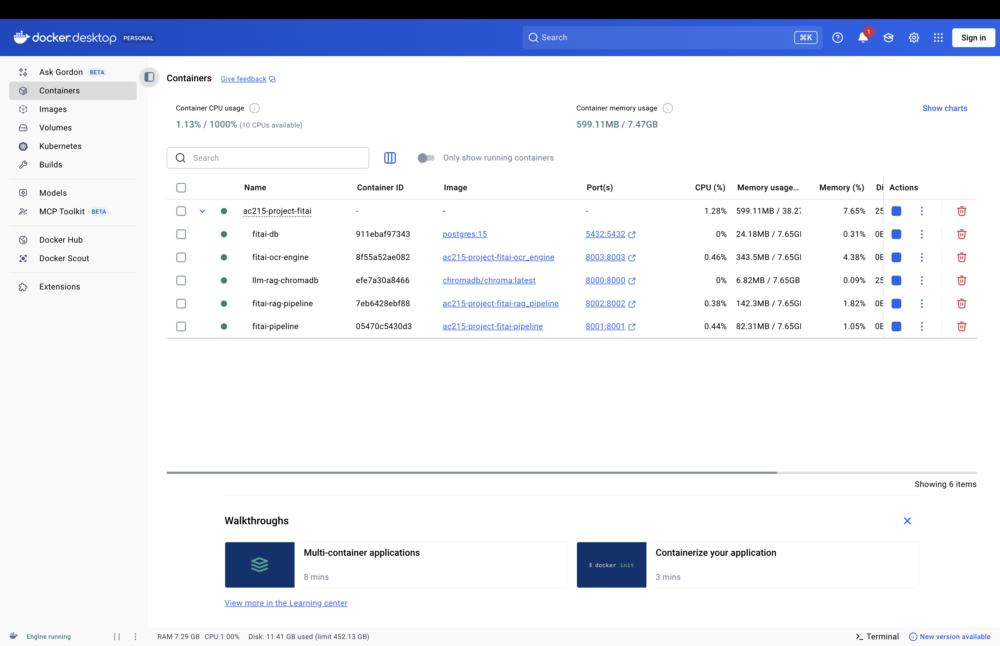

# AC215-Project-FitAI

**FitAI** is a containerized, end-to-end system that delivers personalized fitness recommendations powered by large language models (LLMs) and retrieval-augmented generation (RAG).

The platform integrates user-specific data such as body metrics and training goals with insights extracted from scientific literature on exercise physiology. These research papers are processed through an ETL and RAG pipeline that performs document chunking and vector embedding before storing them in a vector database (ChromaDB). When users interact with the system - whether asking training questions or requesting plan adjustments - the RAG module retrieves the most relevant literature chunks and combines them with the LLM’s reasoning to generate evidence-based, personalized recommendations.

By combining structured user data with knowledge from scientific sources, FitAI aims to create an adaptive and transparent foundation for intelligent fitness planning.

---

## 👩‍💻 Team Members
- Leo Cheng
- Faye Fang  
- Steven Ge  
- Harry Hu

---

## 🖼️ Frontend Mockups
Explore the application's user interface design and key user flows in the [UI Mockups](docs/UI_Mockups.md) document.

---

## 📦 Container Structure
- `services/ocr-engine/` → OCR service that processes literatures from pdf to txt
- `services/rag-service/` → RAG service that handles literature chunking & Chroma insertion
- `services/chromadb/` → Chroma vector database
- (Optional for milestone 2) `services/db/` → main Postgres database (with initialization schema `init.sql`)
- (Optional for milestone 2) `services/core-etl-api/` → Core ETL/API service (loads raw CSVs into Postgres and exposes REST endpoints)
- (Optional for milestone 2) `services/frontend/` → Next.js app (user interface)

---

## 🧠 RAG Training Data Storage

All raw and processed exercise physiology literature, along with relevant training-tracking and exercise catalog data, are stored in a Google Cloud Storage (GCS) bucket.



---

## 📂 Data Versioning (DVC)

We use DVC to version-control all literature data stored in our GCS bucket (gs://fitai-data-bucket).

Setup

dvc import-url gs://fitai-data-bucket fitai_data_bucket
git add fitai_data_bucket.dvc
git commit -m "Track GCS literature dataset with DVC"

Update dataset version

dvc update fitai_data_bucket.dvc
git add fitai_data_bucket.dvc
git commit -m "Update literature dataset version"

Reproduce a dataset version

git checkout <commit>
dvc update fitai_data_bucket.dvc

All actual data remains in GCS; only DVC pointers are stored in Git. 

---

## 🚀 Quick Start

#### Run all containers
```bash
docker compose up --build -d
```



---

### (Optional) Exercise catalog & tracking raw data pipeline
#### (Optional, not needed for RAG or milestone 2) Ingest raw data into the database
```bash
curl -X POST http://localhost:8001/run-etl
```

---

### OCR engine service

#### Use OCR to preprocess phyisology literature from pdf to txt
**Default mode (process only unprocessed PDFs):**
```bash
curl -X POST "http://localhost:8003/perform-ocr"
# equivalent (explicit):
# curl -X POST "http://localhost:8003/perform-ocr?full_process=false"
```
**Full-process mode (re-process all PDFs in raw-literature):**
```bash
curl -X POST "http://localhost:8003/perform-ocr?full_process=true"
```
You should get a quick acknowledgement while the job finished:
```json
{"status": "completed", "message": "OCR process finished."}
```

---

### RAG service

#### Chunk txt files and insert into Chroma
```bash
curl -X POST "http://localhost:8002/process-gcs" \
  -H "Content-Type: application/json" \
  -d '{
    "bucket_name": "fitai-data-bucket",
    "folder_path": "processed-literature",
    "method": "char-split"
  }'
```
**Parameter Explaination**:
- `bucket_name`: GCS bucket name
- `folder_path`: （leave it empty '' means root path）
- `method`: chunking method (`char-split`, `recursive-split`, `semantic-split`)

#### Check ChromaDB collections 
```bash
curl http://localhost:8002/collections
```

```json
{
  "status": "success",
  "collections": [
    {
      "name": "char-split-collection",
      "id": "e4d956fa-dec9-4387-a875-2b8ca587a475"
    }
  ]
}
```

#### Chat
```bash
curl -X POST "http://localhost:8002/chat" \
  -H "Content-Type: application/json" \
  -d '{
    "query": "What are the main findings about resistance training progression?",
    "method": "char-split",
    "n_results": 10
  }'
```

```json
{
  "status": "success",
  "query": "What are the main findings about resistance training progression?",
  "method": "char-split",
  "response": "Based on the provided text chunks, here are the main findings about resistance training progression:\n\n*   Progressive resistance training (RT) protocols are necessary to stimulate further adaptation toward specific training goals.\n*   Proper loading during RT encompasses increasing load based on a percentage of maximal exercise.\n*   It is recommended that CON, ECC, and ISOM actions be included for novice, intermediate, and advanced training.\n*   Training with loads ~60-70% of 1 RM for 8-12 repetitions for novice to intermediate individuals and cycling loads of 80-100% of 1 RM for advanced individuals.\n*   It is recommended that free-weight and machine exercises are included for intermediate training.\n",
  "context_chunks_count": 10
}
```

#### Query
```bash
curl -X POST "http://localhost:8002/query" \
  -H "Content-Type: application/json" \
  -d '{
    "query": "resistance training for beginners",
    "method": "char-split",
    "n_results": 5
  }'
```

```json
{
  "status": "success",
  "query": "resistance training for beginners",
  "method": "char-split",
  "results": {
    "documents": [
      "of Rehabilitation Science, University of Saskatchewan,\nSaskatoon, Canada.\nReceived: 21 July 2021 Accepted: 26 December 2021\nPublished online: 15 January 2022\nReferences\n1. Ratamess NA, Alvar BA, Evetoch TK, Housh TJ, Kibler WB, Kraemer WJ.\nProgression models in resistance training for healthy adults. Med Sci\nSports Exerc. 2009;41(3):687-708. https:",
      "ntermediate training, it is\nrecommended that free-weight and machine exercises are\nincluded (30,169,172,178,248–250,274).\nSPECIAL COMMUNICATIONS\nMedicine & Science in Sports & Exercise Ⓡ 691\nCopyright © 2009 by the American College of Sports Medicine. Unauthorized reproduction of this article is prohibited.\nPROGRESSION AND RESISTANCE TRAINING\n\nEvid",
      " recommended that single- and multiple-joint free-weight and machine exercises be included in novice, intermediate, and advanced individuals.\nFor exercise sequencing, an order similar to strength training is recommended.\nIt is recommended that 1- to 2-min rest periods be used in novice and intermediate training; for advanced training, length of res",
      "xercise intensity (large before small muscle group\nexercises, multiple-joint exercises before single-joint exercises, and\nhigher-intensity before lower-intensity exercises). For novice (untrained\nindividuals with no RT experience or who have not trained for several\nyears) training, it is recommended that loads correspond to a repetition\nrange of an",
      " the American College of Sports Medicine. Unauthorized reproduction of this article is prohibited.\nPROGRESSION AND RESISTANCE TRAINING\n\nexercise. Depending on an individual's training experience\nand current level of fitness, proper loading during RT\nencompasses one or more of the following loading\nschemes: 1) increasing load based on a percentage o"
    ],
    "distances": [
      0.28505242,
      0.30380207,
      0.30402642,
      0.30633307,
      0.31141496
    ],
    "metadatas": [
      {
        "source": "The Effect of Load and Volume Autoregulation on Muscular Strength and Hypertrophy_ A Systematic Review and Meta‑Analysis"
      },
      {
        "source": "Progression Models in Resistance Training for Healthy Adults"
      },
      {
        "source": "Progression Models in Resistance Training for Healthy Adults"
      },
      {
        "source": "Progression Models in Resistance Training for Healthy Adults"
      },
      {
        "source": "Progression Models in Resistance Training for Healthy Adults"
      }
    ],
    "ids": [
      "aa4cb7bce10cd005-2590",
      "20b96aca731571c0-1624",
      "20b96aca731571c0-1780",
      "20b96aca731571c0-1534",
      "20b96aca731571c0-1586"
    ]
  }
}
```
---

#### Shut down and remove containers (when finished)
```bash
docker compose down -v
```
