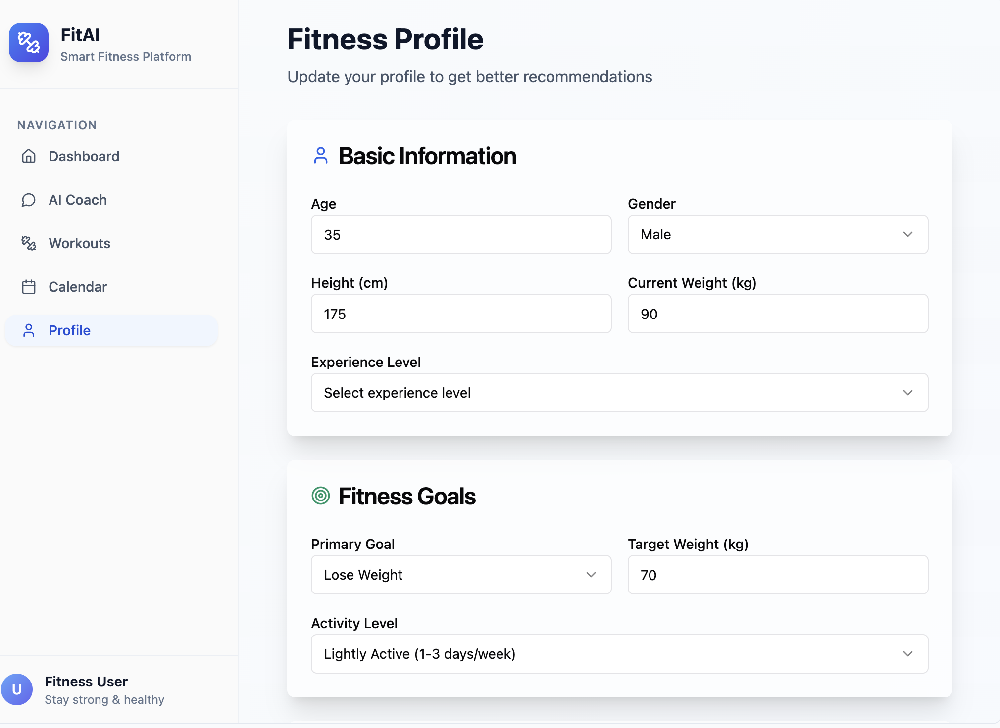
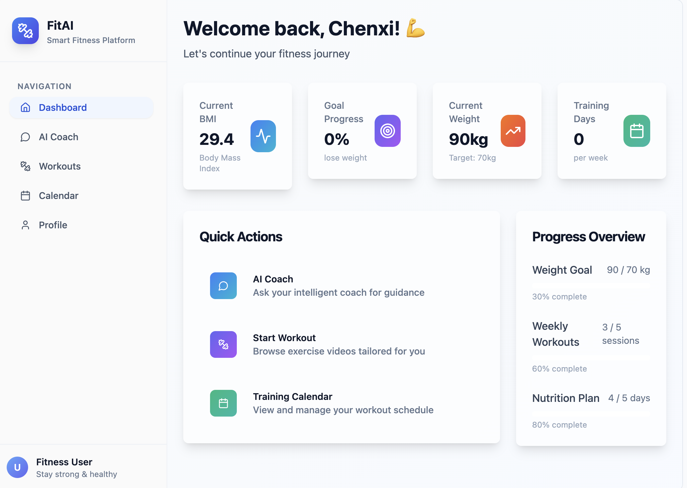
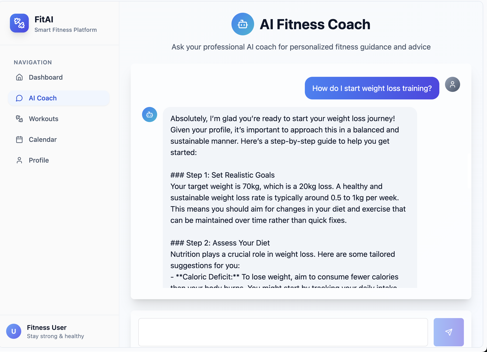

# 🎨 FitAI UI Mockup

## 🧍‍♂️ User Profile

Users are prompted to input their body metrics and define fitness goals upon first login.

## 📊 Dashboard

The RAG algorithm generates a personalized weekly training plan based on each user’s body metrics and goals.
Users can view their plan, track progress, and monitor performance directly from the dashboard.

## 🏋️ Exercise Catalog

Explore a comprehensive library of exercises, each with short and detailed demo videos, as well as clear descriptions and instructions.

## 💬 Chat

Users can ask questions or share feedback about their training plan. The integrated RAG chatbot provides tailored answers and dynamically adjusts the plan based on user input.

