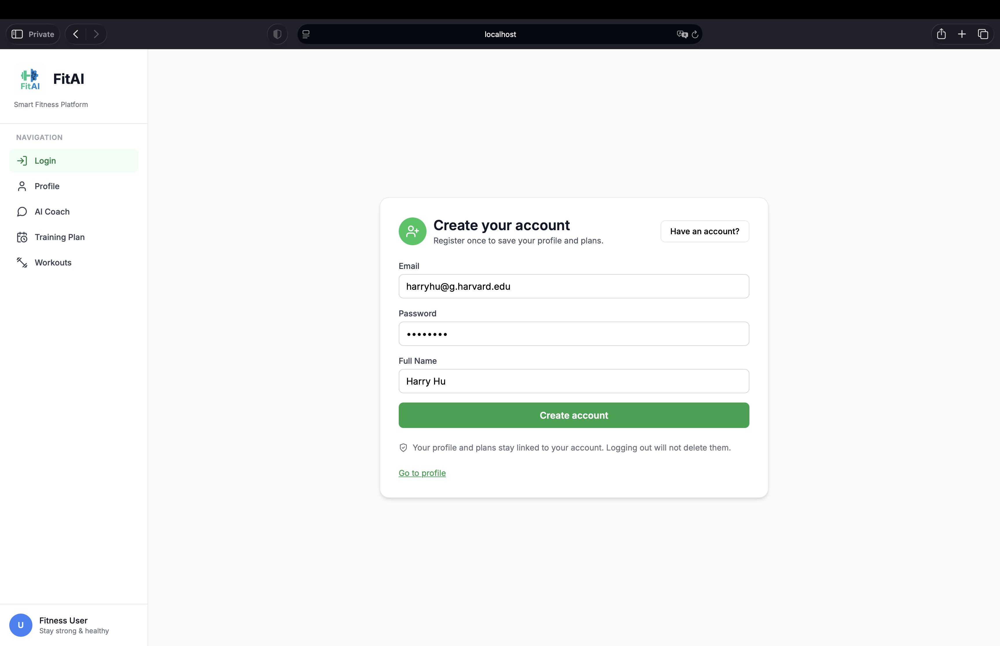
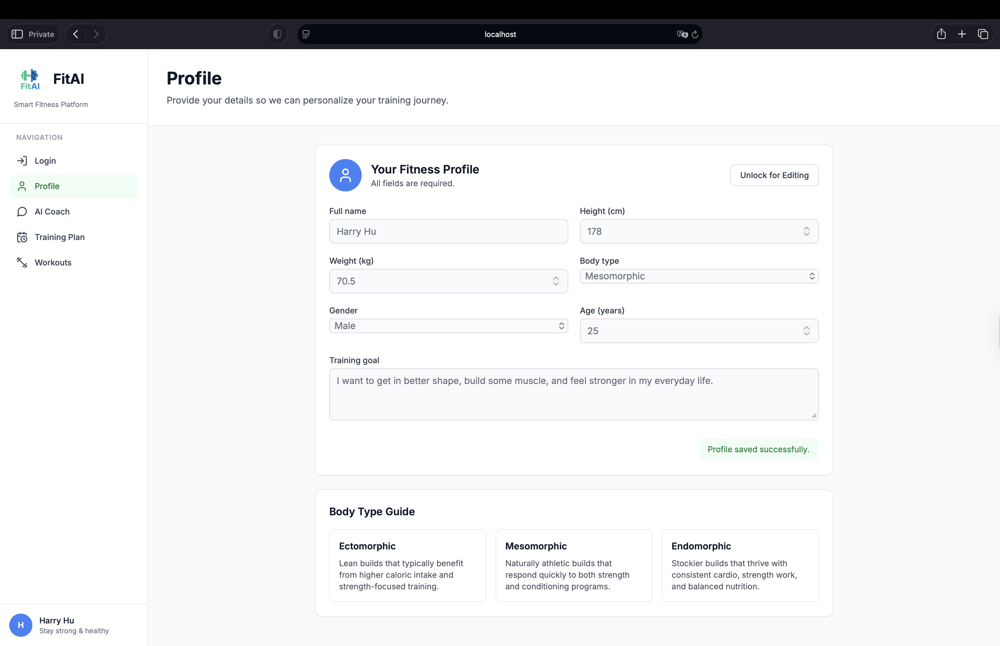
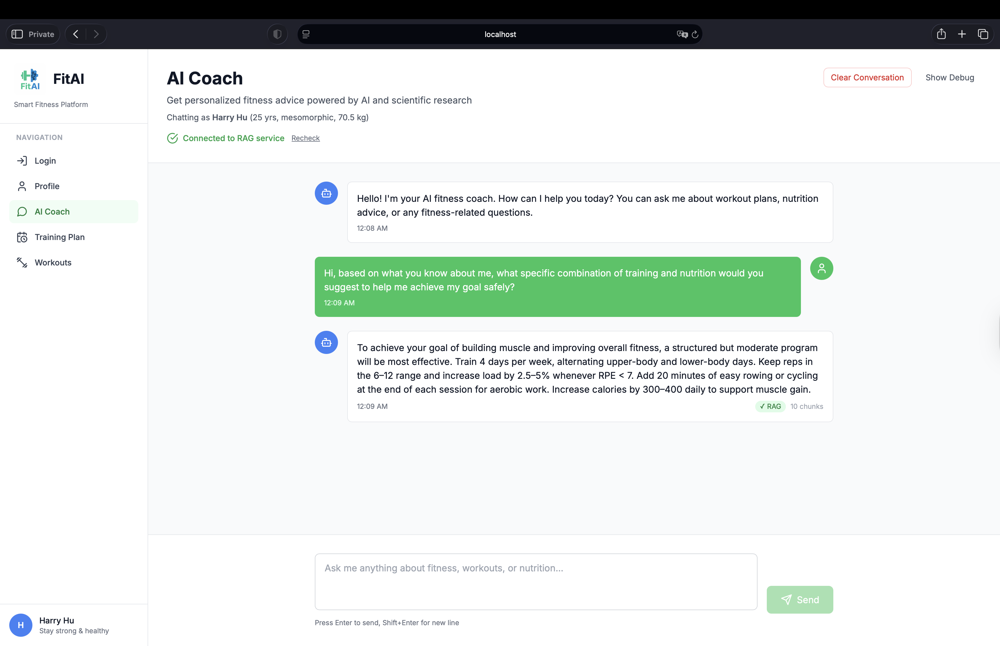
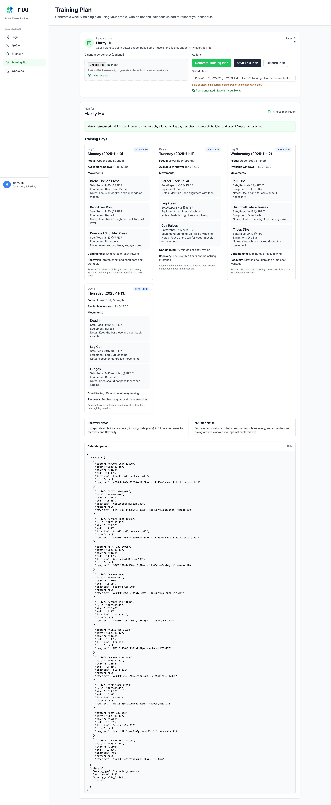
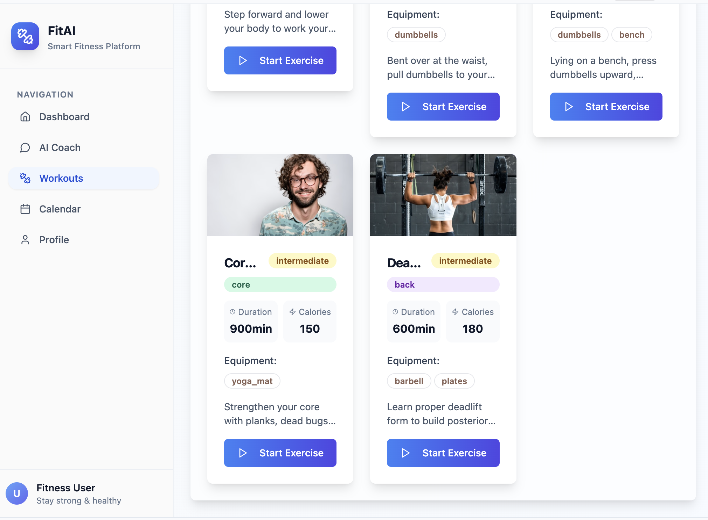

# 🎨 FitAI UI Screens

## 📝 Register

New users create an account with their email, password, and name.

## 🧍‍♂️ User Profile

Users are prompted to input their body metrics and define fitness goals upon first login.

## 🤖 AI Coach Chatbot

Users chat with the AI coach to ask questions or fine-tune their plan. The chatbot already knows your profile details - name, height, weight, gender, body type, age, and training goal - so guidance and plan tweaks stay personal without repeating information.

## 📅 Personalized Training Plans

Upload your calendar to generate weekly training plans that intelligently fit your schedule. Save multiple plans, switch between them, and open any plan to view how sessions align with your availability.

## 🏋️ Exercise Catalog (under dev)

Explore a comprehensive library of exercises, each with short and detailed demo videos, as well as clear descriptions and instructions.

