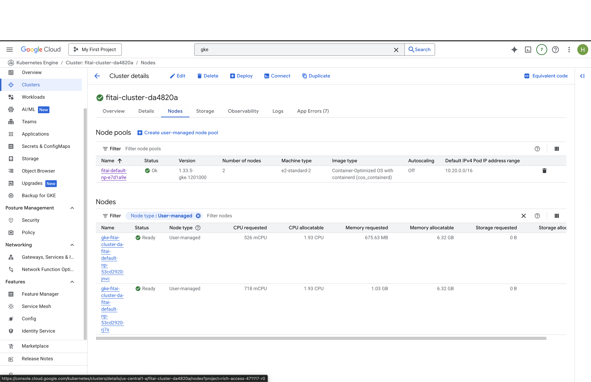
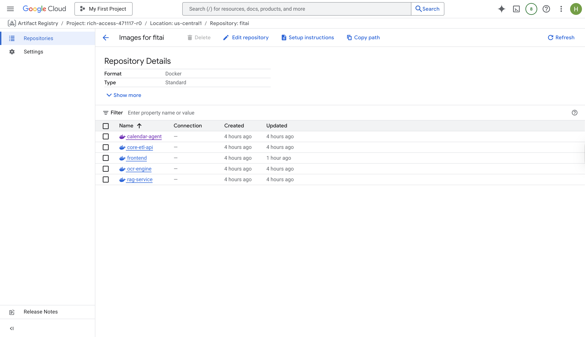
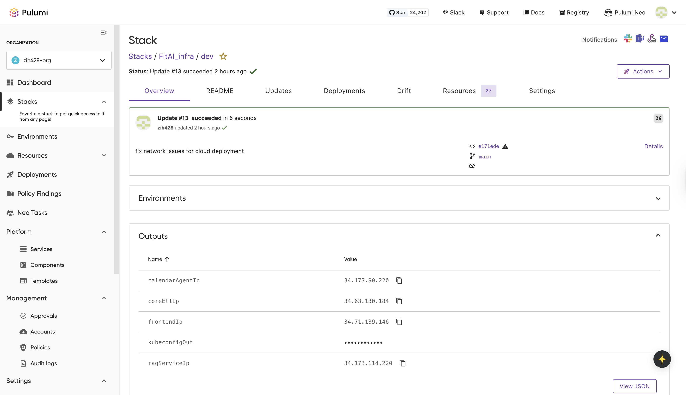
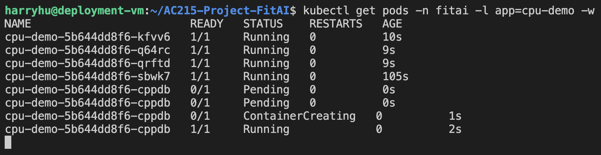
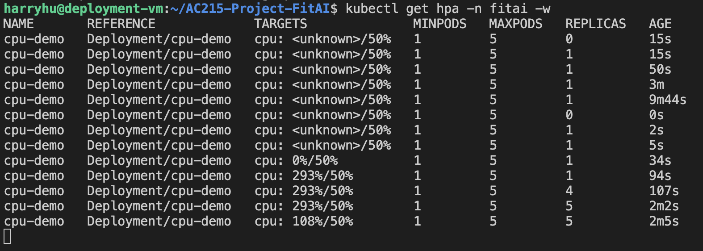
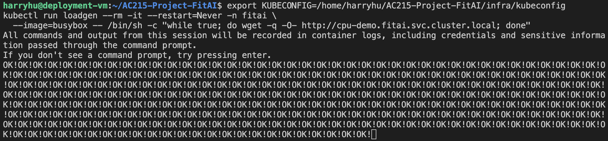

# FitAI Infra (Pulumi + GCP + GKE)

This folder contains the Pulumi TypeScript program that provisions our GCP infrastructure and deploys the FitAI Kubernetes workloads to GKE. It also includes a small HPA demo to showcase autoscaling behavior.

## Tech Stack
- Pulumi (TypeScript) for IaC (`index.ts`)
- GCP: Artifact Registry (Docker), GKE, VPC/Subnet, Load Balancers
- Kubernetes: Deployments, Services (LoadBalancer), Secrets, PVCs
- Kubernetes Autoscaling: Horizontal Pod Autoscaler (HPA) and optional node autoscaling

## What Pulumi Creates (see [`index.ts`](./index.ts))
- VPC and subnetwork with secondary IP ranges for pods/services
- GKE cluster + node pool (COS_containerd, `e2-standard-2`)
- Namespace `fitai`
- Secrets for DB creds/JWT/GCP SA key
- PVCs for Postgres and ChromaDB
- Deployments + Services:
  - core-etl-api (LB)
  - rag-service (LB)
  - calendar-agent (LB)
  - ocr-engine
  - frontend (LB)
  - postgres + chromadb
- Outputs: kubeconfig, frontend/core-etl/rag/calendar LB IPs

## Deploying the Stack (CI/CD)
### Automated (recommended)
- GitHub Actions workflow `CD` runs on pushes to `main` (or manual dispatch). It:
  - Auths to GCP via `GCP_CREDENTIALS_JSON` secret (service account with Artifact Registry + GKE perms).
  - Builds/pushes all service images to `us-central1-docker.pkg.dev/rich-access-471117-r0/fitai` with tag `${GITHUB_SHA}`.
  - Sets Pulumi config `image:*` values for those tags on stack `FitAI_infra/dev` and runs `pulumi up`.
- Required GitHub secrets: `PULUMI_ACCESS_TOKEN`, `GCP_CREDENTIALS_JSON`, optional `PULUMI_CONFIG_PASSPHRASE` (if you enable it) and any app secrets stored as Pulumi config (`dbPassword`, `jwtSecret`, `gcpServiceAccountKey`, etc.).
- To trigger manually: GitHub → Actions → “CD” → “Run workflow” on branch `main`.

### Manual
```bash
export PATH=$PATH:$HOME/.pulumi/bin
export PULUMI_HOME=/home/harryhu/AC215-Project-FitAI/.pulumi-home
cd infra
pulumi stack select zih428-org/FitAI_infra/dev
pulumi up
```
Prereqs: `gcloud auth login`, `gcloud auth application-default login`, `gcloud config set project rich-access-471117-r0`, Node 20+, Pulumi CLI, and images pushed to Artifact Registry (`us-central1-docker.pkg.dev/rich-access-471117-r0/fitai/...`). If you want manual deploys to mirror CI tags, build/push images locally and set `pulumi config set image:<service> ... --stack FitAI_infra/dev` before `pulumi up`.

## Proof of Deployment (GCP/GKE)
- GKE Console (Clusters/Workloads/Services): 
- Artifact Registry console shows images under `fitai` repo: 
- Pulumi stack outputs (load balancer IPs + kubeconfig secret) from the latest update: 

## HPA Demo (K8s Autoscaling)
- Manifest: [`hpa-demo.yaml`](./hpa-demo.yaml) (Deployment + Service + HPA for `cpu-demo`)
- Apply & load test:
  ```bash
  export KUBECONFIG=/home/harryhu/AC215-Project-FitAI/infra/kubeconfig
  kubectl apply -f hpa-demo.yaml
  kubectl get pods -n fitai -l app=cpu-demo -w    # watch pods
  kubectl get hpa -n fitai -w                     # watch HPA
  kubectl run loadgen --rm -it --restart=Never -n fitai \
    --image=busybox -- /bin/sh -c "while true; do wget -q -O- http://cpu-demo.fitai.svc.cluster.local; done"
  ```
- Autoscaling evidence:
  - Pods scaling up under load: 
  - HPA driving replica count based on CPU: 
  - Load generator running inside the cluster: 
- Cleanup:
  ```bash
  kubectl delete -f hpa-demo.yaml
  ```

## Notes
- kubeconfig is generated via `pulumi stack output kubeconfigOut`; keep it out of git.
- `.pulumi-home/` stores Pulumi credentials/state for this machine; keep it out of git.
- Frontend builds bake backend LB URLs via build args in `services/frontend/Dockerfile`.

Happy shipping!  
